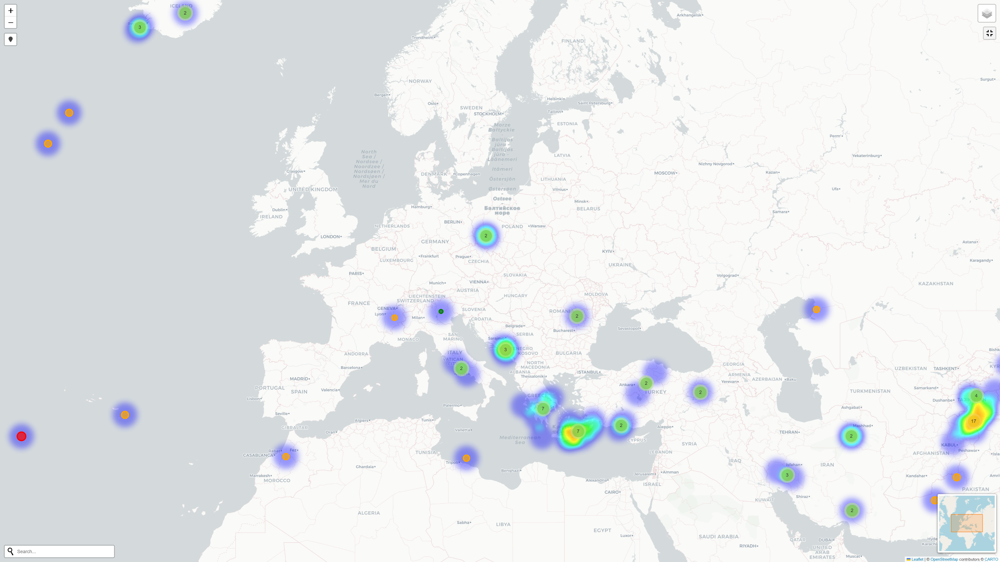

# Real-Time Earthquake Map

This project visualizes real-time earthquake data on an interactive map using Python and [Folium](https://python-visualization.github.io/folium/). Earthquake data is fetched from the USGS GeoJSON feed and displayed with both marker clusters and a heatmap overlay.

## Features

- Real-time earthquake data for the past month from USGS
- Interactive map with zoom and pan
- Marker clusters showing earthquake locations, color-coded by magnitude
- Popups with details: location, magnitude, depth, and time
- Heatmap layer visualizing earthquake density and strength
- MiniMap, fullscreen, geocoder, and locate controls

## Requirements

- Python 3.7+
- [folium](https://pypi.org/project/folium/)
- [requests](https://pypi.org/project/requests/)

Install dependencies with:

```sh
pip install folium requests
```

## Usage

1. Run the script:

    ```sh
    python earthquake_map.py
    ```

2. After processing, open `earthquake_map.html` in your browser to view the map.

## Files

- [`earthquake_map.py`](earthquake_map.py): Main script to generate the earthquake map.
- [`earthquake_map.html`](earthquake_map.html): Output HTML file with the interactive map.

## Data Source

Earthquake data is retrieved from the [USGS Earthquake Hazards Program](https://earthquake.usgs.gov/earthquakes/feed/v1.0/geojson.php).

## Example


